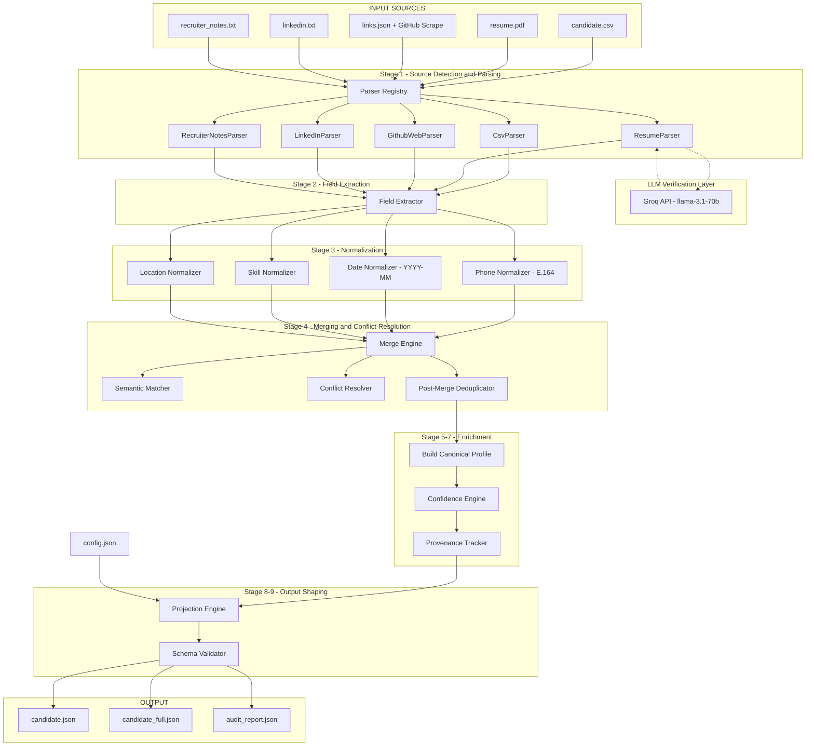
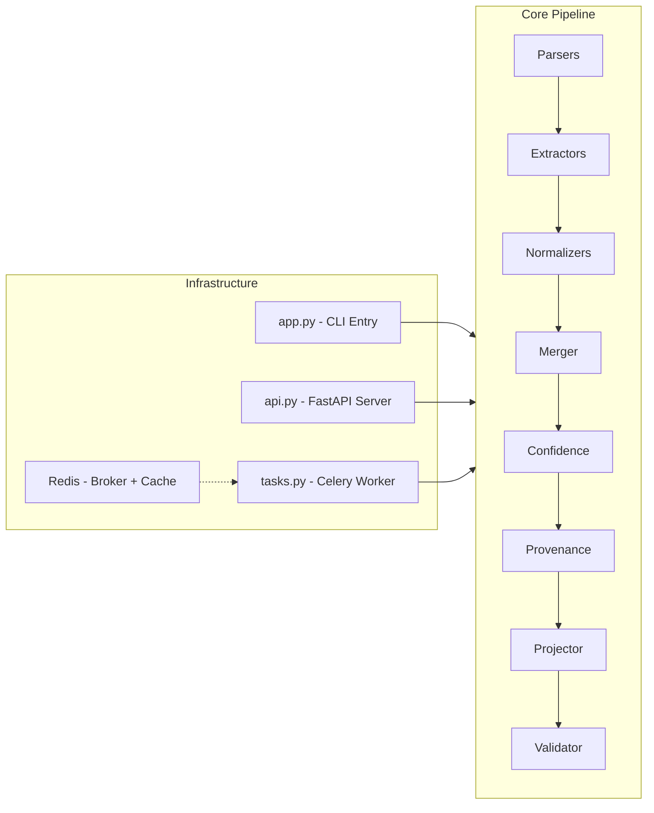
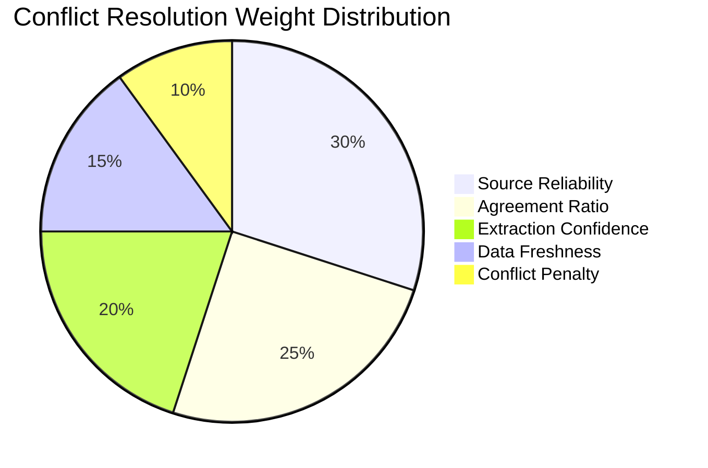
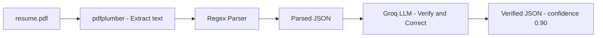
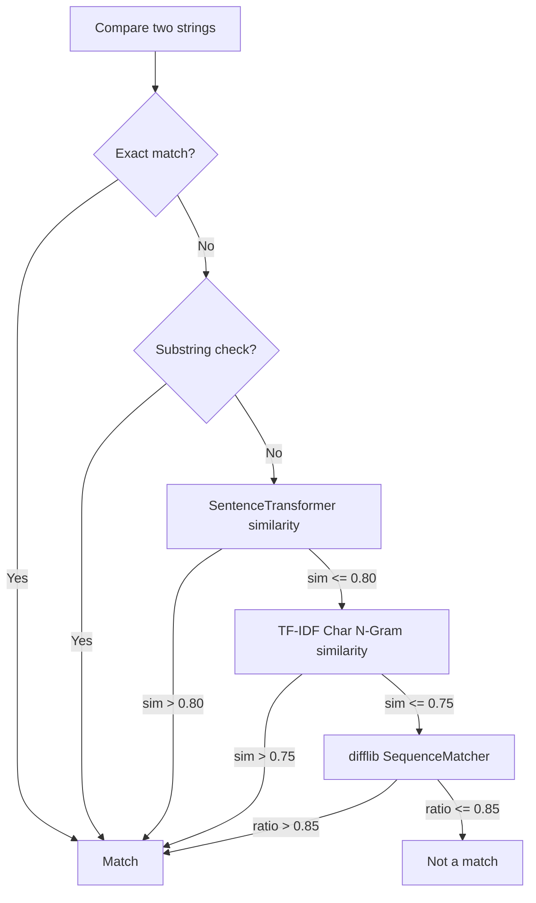
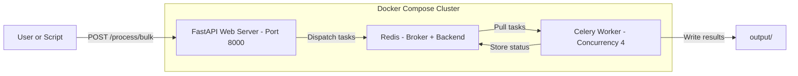

# 🔄 Multi-Source Candidate Profile Transformer

**An intelligent data pipeline that ingests candidate information from multiple heterogeneous sources, resolves conflicts, normalizes data, and produces a single unified canonical JSON profile with per-field confidence scores, provenance tracking, and a full audit trail.**

<p align="center">

[](#prerequisites)
[](#api-server)
[](#-option-2-distributed-mode-with-docker-compose)
[](#-when-does-the-llm-come-into-the-picture)
[](#license)

</p>

---

## 📑 Table of Contents

- [Overview](#-overview)
- [Complete Pipeline Flow (Interactive Diagram)](#-complete-pipeline-flow)
- [Architecture](#-architecture)
- [Input Format](#-input-format)
- [Output Format](#-output-format)
- [Conflict Resolution — How It Works](#%EF%B8%8F-conflict-resolution--how-it-works)
- [When Does the LLM Come Into the Picture?](#-when-does-the-llm-come-into-the-picture)
- [Semantic Matching & Deduplication](#-semantic-matching--deduplication)
- [Confidence Scoring](#-confidence-scoring)
- [How to Run the Project](#-how-to-run-the-project)
  - [Prerequisites](#prerequisites)
  - [Local CLI Mode](#-option-1-local-cli-mode-single-machine)
  - [Distributed Docker Compose Mode](#-option-2-distributed-mode-with-docker-compose)
  - [When to Use Which Mode](#-when-to-use-which-mode)
- [Runtime Configuration (config.json)](#%EF%B8%8F-runtime-configuration)
- [Testing](#-testing)
- [Project Structure](#-project-structure)
- [Design Decisions](#-design-decisions)

---

## 🌟 Overview

Recruiting teams collect candidate data from **multiple, overlapping, sometimes contradictory sources** — a CSV from the ATS, a PDF resume, a scraped LinkedIn profile, a GitHub profile, and freeform recruiter notes. This pipeline **automatically fuses** all of them into one clean, deduplicated, confidence-scored JSON profile.

### Key Capabilities

| Capability | Description |
|---|---|
| **5 Source Parsers** | CSV, Resume (PDF), GitHub (JSON/web), LinkedIn (TXT), Recruiter Notes (TXT) |
| **LLM Verification** | Groq-powered verification of resume parsing to correct extraction errors |
| **Semantic Matching** | SentenceTransformer + TF-IDF + difflib cascade for deduplication |
| **Conflict Resolution** | Weighted scoring formula using source reliability, agreement, freshness, extraction confidence |
| **Normalization** | Phones → E.164, dates → YYYY-MM, skills → canonical names, locations → structured objects |
| **Confidence Scoring** | Deterministic per-field and overall confidence (0.0–1.0) |
| **Provenance Tracking** | Every field traces back to its source(s) and extraction method |
| **Output Projection** | Runtime `config.json` reshapes the output without modifying the canonical profile |
| **Audit Trail** | Complete `audit_report.json` with every transformation, conflict, and deduplication logged |
| **Distributed Processing** | Docker Compose + Celery + Redis for parallel bulk candidate processing |

---

## 🔁 Complete Pipeline Flow

The following diagram shows the **end-to-end flow** of how data moves through the system, from raw input files to the final JSON output:



### Step-by-Step Walkthrough

| Stage | What Happens | Key Decision |
|---|---|---|
| **1. Source Detection** | The Parser Registry scans the input directory. Each file is tested against 5 registered parsers (CSV, Resume, GitHub, LinkedIn, Recruiter Notes). First match wins. | Plug-and-play — add a new parser in 1 file, register it in the registry. |
| **2. Field Extraction** | Raw parsed fields are mapped to canonical names (e.g., `name` → `full_name`, `phone` → `phones`). | Standardizes heterogeneous field names from different sources. |
| **🤖 LLM Verification** | **Only for resume.pdf**: The deterministic parser's output is sent to Groq LLM for verification/correction. See [LLM section](#-when-does-the-llm-come-into-the-picture). | Catches regex parser mistakes without hallucinating new data. |
| **3. Normalization** | Phones → E.164 (`+916207851006`), dates → YYYY-MM (`2025-09`), skills → canonical (`ML` → `Machine Learning`), locations → structured `{city, region, country}`. | Every transformation is logged in the audit trail. |
| **4. Merging** | Data from all sources is combined. **Scalar fields** use conflict resolution. **List fields** (skills, emails) use semantic union. **Structured lists** (experience, education) use semantic deduplication. | See [Conflict Resolution](#%EF%B8%8F-conflict-resolution--how-it-works). |
| **5. Canonical Profile** | A Pydantic `CanonicalProfile` model is built from the merged data. This is the single source of truth. | Never modified by runtime config — only the projected output changes. |
| **6. Confidence Scoring** | Deterministic per-field confidence using weighted formula (source reliability, agreement, extraction confidence, normalization, conflicts). | See [Confidence Scoring](#-confidence-scoring). |
| **7. Provenance** | Each field is annotated with which source(s) contributed it and what extraction method was used. | Full traceability for auditing. |
| **8. Projection** | The `config.json` reshapes the output (rename fields, select subsets, flatten arrays). | The canonical profile is untouched; only the output view changes. |
| **9. Validation** | The final output is validated against the expected schema. Warnings and errors are recorded. | Catches structural issues before writing to disk. |
| **10. Output** | Three files are written: `candidate.json` (projected), `candidate_full.json` (complete), `audit_report.json` (audit trail). | — |

---

## 🏗 Architecture



The architecture follows a **clean separation of concerns**:

- **`app.py`** — CLI entry point. Zero business logic. Parses args, delegates to `Pipeline`.
- **`api.py`** — FastAPI server for HTTP-based processing and bulk dispatch.
- **`pipeline.py`** — Orchestrator. The **only file** that knows about all stages.
- **Each stage** (parsers, extractors, normalizers, merger, etc.) is in its own module and is independently testable.

---

## 📥 Input Format

### Supported Source Files

Place these files inside a candidate folder (e.g., `input/candidates/john_doe/`):

| File | Format | Description | Required? |
|---|---|---|---|
| `candidate.csv` | CSV | Structured ATS data with columns: `name`, `email`, `phone`, `current_company`, `title`, `location`, `skills`, `linkedin` | No |
| `resume.pdf` | PDF | Unstructured resume. Parsed via `pdfplumber` + regex section detection + **LLM verification** | No |
| `links.json` | JSON | Contains `github_url` key — the pipeline scrapes the GitHub profile live | No |
| `linkedin.txt` | TXT | Scraped/copy-pasted LinkedIn profile text | No |
| `recruiter_notes.txt` | TXT | Free-form recruiter observations and notes | No |
| `config.json` | JSON | Output projection configuration (optional, can be at parent level) | No |

> **Note:** At least one source file must be present. The pipeline auto-detects which files exist and only parses those.

### Example Input Structure

```
input/
├── config.json                    # Shared config (applied to all candidates)
└── candidates/
    ├── sushant_kumar/
    │   ├── candidate.csv
    │   ├── resume.pdf
    │   ├── links.json             # {"github_url": "https://github.com/sushantkumar143"}
    │   ├── linkedin.txt
    │   └── recruiter_notes.txt
    ├── jane_doe/
    │   ├── candidate.csv
    │   └── resume.pdf
    └── edge_case_conflict/
        ├── candidate.csv          # Says "San Francisco"
        ├── resume.pdf             # Says "SF Bay Area"
        └── linkedin.txt           # Says "San Francisco, CA"
```

### Sample `candidate.csv`

```csv
name,email,phone,current_company,title,location,skills,linkedin
Sushant Kumar,sushant14300@gmail.com,+91-6207851006,AICTE - Edunet Foundation,Virtual Intern,"Phagwara, Punjab","C++, Python, Java, JavaScript, React, FastAPI, Docker, AWS, Git, RAG, LLMs",https://linkedin.com/in/sushant-kumar-97978b28b
```

### Sample `links.json`

```json
{
  "github_url": "https://github.com/sushantkumar143"
}
```

---

## 📤 Output Format

The pipeline produces **three output files** per candidate:

### 1. `candidate.json` — Projected Output

This is the **primary output**, shaped by your `config.json`. Example:

```json
{
  "candidate_id": "4b7e121e66cc",
  "full_name": "Sushant Kumar",
  "primary_email": "sushant14300@gmail.com",
  "phone": "+916207851006",
  "skills": [
    {
      "name": "Python",
      "confidence": 0.917,
      "sources": ["csv", "github", "resume"]
    },
    {
      "name": "Docker",
      "confidence": 0.917,
      "sources": ["csv", "github", "resume"]
    }
  ],
  "links": {
    "linkedin": "https://linkedin.com/in/sushant-kumar-97978b28b",
    "github": "https://github.com/sushantkumar143"
  },
  "headline": "Virtual Intern at AICTE - Edunet Foundation",
  "location": {
    "city": "Phagwara",
    "region": null,
    "country": "Punjab"
  },
  "years_experience": 0.2,
  "overall_confidence": 0.697
}
```

### 2. `candidate_full.json` — Complete Canonical Profile

The unprojected, full canonical profile with **all fields**, including provenance and per-field confidence. Useful for debugging and downstream integrations.

### 3. `audit_report.json` — Audit Trail

A detailed record of everything the pipeline did:

```json
{
  "processing_timestamp": "2026-07-01T03:55:28.084662+00:00",
  "processing_duration_ms": 33838,
  "sources_detected": ["candidate.csv", "links.json", "resume.pdf"],
  "total_transformations": 13,
  "transformations": [
    {
      "field": "phone",
      "type": "normalization",
      "before": "+91-6207851006",
      "after": "+916207851006"
    },
    {
      "field": "skill",
      "type": "normalization",
      "before": "ML",
      "after": "Machine Learning"
    },
    {
      "field": "experience.start",
      "type": "normalization",
      "before": "Sep 2025",
      "after": "2025-09"
    }
  ],
  "conflicts": [],
  "data_quality": {
    "profile_completeness": 1.0,
    "filled_count": 9,
    "missing_count": 0
  },
  "field_confidences": {
    "full_name": 0.82,
    "emails": 0.917,
    "skills": 0.917,
    "experience": 0.69
  }
}
```

---

## ⚔️ Conflict Resolution — How It Works

When the **same field** has **different values** across sources, the Conflict Resolver kicks in.

### Example Conflict

| Source | `full_name` value |
|---|---|
| CSV | `Sushant Kumar` |
| Resume | `SUSHANT KUMAR` |
| LinkedIn | `Sushant K.` |

### Resolution Formula

Each conflicting value is scored using this **weighted formula**:

```
Score = (Source Reliability × 0.30)
      + (Agreement Ratio   × 0.25)
      + (Extraction Conf.  × 0.20)
      + (Data Freshness    × 0.15)
      - (Conflict Penalty  × 0.10)
```



### Factor Breakdown

| Factor | What It Measures | How It's Computed |
|---|---|---|
| **Source Reliability** | How trustworthy is this source *for this specific field*? | Field-specific reliability matrix (e.g., LinkedIn is 0.85 for `full_name`, but GitHub is only 0.60) |
| **Agreement Ratio** | How many sources agree on this value? | `agreeing_sources / total_sources` — majority wins |
| **Extraction Confidence** | How confident was the parser in extracting this value? | Parser-assigned confidence (PDF regex = 0.70, CSV structured = 0.80, LLM-verified = 0.90) |
| **Data Freshness** | How recently was this source file modified? | Normalized file modification timestamp (0.0 = oldest, 1.0 = newest) |
| **Conflict Penalty** | Penalty for having many conflicting values | `(unique_values - 1) / unique_values` — more disagreement = higher penalty |

### Field-Specific Source Reliability Matrix

The system uses a **field-specific reliability matrix** — not just one reliability score per source:

| Field | CSV | LinkedIn | Resume | GitHub | Recruiter Notes |
|---|---|---|---|---|---|
| `full_name` | 0.90 | 0.85 | 0.70 | 0.60 | 0.50 |
| `emails` | 0.95 | 0.90 | 0.85 | 0.90 | 0.50 |
| `skills` | 0.70 | 0.85 | 0.80 | **0.90** | 0.50 |
| `experience` | 0.60 | 0.80 | **0.85** | 0.40 | 0.50 |
| `links` | 0.80 | 0.90 | 0.85 | **0.95** | 0.50 |

> **Design rationale:** GitHub is the *most* reliable for skills and links (objectively verifiable from repos), while the resume is most reliable for experience details (self-authored, detailed descriptions).

### What Gets Conflict-Resolved vs. Merged

| Field Type | Strategy | Example |
|---|---|---|
| **Scalar fields** (`full_name`, `headline`) | Conflict resolution (scoring formula) | Pick "Sushant Kumar" over "SUSHANT KUMAR" |
| **List fields** (`skills`, `emails`, `phones`) | Semantic union (keep all unique values) | Merge `[Python, JS]` + `[Python, React]` → `[Python, JS, React]` |
| **Structured lists** (`experience`, `education`) | Semantic deduplication + enrichment | Two "Google" entries from different sources → merged into one richer entry |
| **Dict fields** (`links`, `location`) | Deep merge by source reliability | Higher-reliability source's keys take priority |

---

## 🤖 When Does the LLM Come Into the Picture?

The LLM is used at **exactly one point** in the pipeline — as a **verification layer for resume PDF parsing**.



### Why Only for Resumes?

| Source | Parser Type | Why No LLM? |
|---|---|---|
| **CSV** | Structured (column mapping) | Already highly structured — no ambiguity |
| **GitHub** | JSON/web scraping | Structured API data — deterministic |
| **LinkedIn** | Text pattern matching | Semi-structured — regex is sufficient |
| **Recruiter Notes** | NLP keyword extraction | Low reliability anyway — LLM won't help much |
| **Resume (PDF)** ✅ | **Unstructured text → regex** | **Regex can misparse sections, miss fields, or split entries incorrectly. The LLM acts as a verifier.** |

### How the LLM Verifier Works

1. **Input**: The raw resume text + the deterministic parser's JSON output are sent together.
2. **Prompt**: The LLM is instructed to:
   - Verify each parsed field against the raw text
   - Correct errors (but **ONLY** based on what's explicitly in the text)
   - **Never hallucinate** — if a value can't be verified, leave it as-is or null
   - Exclude academic/personal projects from the `experience` section
3. **Output**: Corrected JSON in the exact same structure.
4. **Confidence Boost**: LLM-verified parsing gets a confidence of **0.90** vs **0.70** for regex-only.

### LLM Fallback Chain

The system tries multiple API keys and models in sequence:

```
Groq API Key 1 + llama-3.1-70b-versatile
    ↓ (on failure)
Groq API Key 1 + llama-3.1-8b-instant
    ↓ (on failure)
Groq API Key 2 + llama-3.1-70b-versatile
    ↓ (on failure)
Groq API Key 2 + llama-3.1-8b-instant
    ↓ ... (up to 3 keys × 2 models = 6 attempts)
    ↓ (all fail)
Return original regex-parsed JSON (graceful degradation)
```

> **Important:** If no Groq API key is provided, the pipeline **still works** — it just uses the deterministic regex parser with lower confidence (0.70). The LLM is an **enhancement**, not a requirement.

### Providing Groq API Keys

**Linux / macOS:**

```bash
# Set one or more Groq API keys as environment variables
export GROQ_API_KEY_1="gsk_your_primary_key_here"
export GROQ_API_KEY_2="gsk_your_backup_key_here"       # Optional backup
export GROQ_API_KEY_3="gsk_your_tertiary_key_here"     # Optional backup

# Then run the pipeline
python app.py --input input/candidates
```

**Windows (PowerShell):**

```powershell
$env:GROQ_API_KEY_1 = "gsk_your_primary_key_here"
$env:GROQ_API_KEY_2 = "gsk_your_backup_key_here"
python app.py --input input/candidates
```

> 🔑 **Get your free API key at [console.groq.com](https://console.groq.com)**. The free tier provides generous rate limits sufficient for this pipeline.

---

## 🔗 Semantic Matching & Deduplication

The pipeline uses a **three-tier similarity cascade** to determine if two values are semantically equivalent:



This cascade ensures:
- **Fast path**: Exact/substring matches are caught immediately (O(1)).
- **Robust fallback**: Even if SentenceTransformers can't load (offline environment), TF-IDF and difflib still work as fully offline fallbacks.

### Where Semantic Matching Is Used

- **Skill deduplication**: `"React.js"` ≡ `"ReactJS"` ≡ `"React"`
- **Experience merging**: Two entries from different sources about the same job (matched by company name + title) are merged into one richer entry
- **Education merging**: `"MIT"` ≡ `"Massachusetts Institute of Technology"`

---

## 📊 Confidence Scoring

Every field gets a **deterministic, explainable confidence score** (0.0–1.0):

```
FieldConfidence = (Source Reliability  × 0.30)
               + (Agreement Ratio     × 0.30)
               + (Extraction Conf.    × 0.20)
               + (Normalization OK    × 0.10)
               + (No Conflicts        × 0.10)
```

**Overall profile confidence** = weighted mean of field confidences × completeness factor.

---

## 🚀 How to Run the Project

### Prerequisites

- **Python 3.10+**
- **pip** (package manager)
- **Groq API Key** (for LLM verification — optional but recommended)
- **Docker & Docker Compose** (only for distributed mode)

### ⚡ Option 1: Local CLI Mode (Single Machine)

Best for: **1–10 candidates**, quick testing, development.

```bash
# 1. Clone the repository
git clone https://github.com/sushantkumar143/Multi-source-Candidate-Profile-Transformer.git
cd Multi-source-Candidate-Profile-Transformer

# 2. Install dependencies
pip install -r requirements.txt

# 3. Set your Groq API key (optional but recommended)
export GROQ_API_KEY_1="gsk_your_key_here"          # Linux/Mac
# $env:GROQ_API_KEY_1 = "gsk_your_key_here"        # Windows PowerShell

# 4. Run the pipeline
python app.py --input input/candidates
```

#### CLI Options

```bash
# Process a single candidate folder
python app.py --input input/candidates/sushant_kumar

# Process all candidates in a folder (batch mode)
python app.py --input input/candidates

# Specify custom config and output directory
python app.py --input input/candidates --config input/config.json --output my_output/

# Verbose logging
python app.py --input input/candidates --log-level DEBUG

# Write logs to a file
python app.py --input input/candidates --log-file pipeline.log
```

#### Full CLI Reference

| Flag | Short | Description | Default |
|---|---|---|---|
| `--input` | `-i` | Path to input directory (required) | — |
| `--config` | `-c` | Path to config.json | Auto-discovered in input dir |
| `--output` | `-o` | Path to output directory | `output/` |
| `--log-level` | `-l` | Logging level: DEBUG, INFO, WARNING, ERROR | `INFO` |
| `--log-file` | — | Write logs to a file | None (stdout only) |

#### How Batch Mode Works

If the input directory contains **subdirectories**, the pipeline automatically enters **batch mode** and processes each subdirectory as a separate candidate:

```
input/candidates/           ← You point --input here
├── sushant_kumar/          ← Processed as candidate 1
├── jane_doe/               ← Processed as candidate 2
└── edge_case_conflict/     ← Processed as candidate 3
```

```bash
$ python app.py --input input/candidates

[INFO] Found 3 candidate folders. Running batch mode...
Processing candidate: sushant_kumar
Processing candidate: jane_doe
Processing candidate: edge_case_conflict

[INFO] Batch complete. Successfully processed 3/3 candidates.
```

Output is organized per-candidate:

```
output/
├── sushant_kumar/
│   ├── candidate.json
│   ├── candidate_full.json
│   └── audit_report.json
├── jane_doe/
│   └── ...
└── edge_case_conflict/
    └── ...
```

---

### 🐳 Option 2: Distributed Mode with Docker Compose

Best for: **10+ candidates**, production deployments, when you need **parallel/concurrent processing**.

The distributed mode uses a **three-service architecture**:



#### How It Works

1. **Redis** acts as the Celery message broker (task queue) and result backend.
2. **FastAPI Web Server** exposes HTTP endpoints for submitting candidates.
3. **Celery Worker** pulls tasks from the Redis queue and processes each candidate folder through the full pipeline **in parallel** (default concurrency: 4 workers).

#### Step-by-Step Setup

```bash
# 1. Make sure Docker and Docker Compose are installed
docker --version
docker compose version

# 2. Set your Groq API key in the environment (optional)
export GROQ_API_KEY_1="gsk_your_key_here"

# 3. Place your candidate folders in input/candidates/
#    Each candidate should be a subdirectory with source files.

# 4. Build and start all services
docker compose up --build

# 5. (In a new terminal) Dispatch bulk processing
python bulk_dispatch.py --input input/candidates

# 6. Watch the worker logs
docker compose logs -f worker

# 7. When done, stop all services
docker compose down
```

#### Alternative: Use the API Directly

Instead of the CLI dispatcher, you can use the REST API:

```bash
# Process a single candidate via file upload
curl -X POST http://localhost:8000/process \
  -F "resume=@input/candidates/sushant_kumar/resume.pdf" \
  -F "csv=@input/candidates/sushant_kumar/candidate.csv" \
  -F "links=@input/candidates/sushant_kumar/links.json"

# Dispatch bulk processing to Celery workers
curl -X POST http://localhost:8000/process/bulk \
  -H "Content-Type: application/json" \
  -d '{"input_dir": "input/candidates", "output_dir": "output"}'

# Health check
curl http://localhost:8000/health
```

#### Docker Compose Services

| Service | Container | Role | Port |
|---|---|---|---|
| `redis` | `candidate-redis` | Message broker + result backend | 6379 |
| `web` | `candidate-web` | FastAPI server (accepts requests) | 8000 |
| `worker` | `candidate-worker` | Celery worker (processes pipelines) | — |

#### Celery Worker Configuration

The worker is configured for **reliability**:

| Setting | Value | Why |
|---|---|---|
| `concurrency` | 4 | Process 4 candidates simultaneously |
| `task_acks_late` | True | If worker crashes, task is re-queued |
| `worker_prefetch_multiplier` | 1 | Don't hoard tasks; fair distribution |
| `max_retries` | 2 | Auto-retry failed tasks with exponential backoff |
| `result_expires` | 3600s | Clean up results after 1 hour |

---

### 📋 When to Use Which Mode

| Criteria | CLI Mode | Docker Compose Mode |
|---|---|---|
| **Number of candidates** | 1–10 | 10–1000+ |
| **Setup complexity** | `pip install` only | Requires Docker |
| **Parallelism** | Sequential (one at a time) | Concurrent (4+ workers) |
| **Fault tolerance** | None (crash = restart) | Auto-retry with backoff |
| **API access** | No | Yes (`/process`, `/process/bulk`) |
| **Scaling** | Not possible | `--scale worker=N` |
| **Best for** | Development, testing, demos | Production, batch runs |

**Decision guide:**

- **1–10 candidates?** → Use CLI: `python app.py --input input/candidates`
- **10–100+ candidates?** → Use Docker Compose: `docker compose up --build`
- **1000+ candidates?** → Scale workers: `docker compose up --scale worker=8`

---

## ⚙️ Runtime Configuration

The `config.json` file controls **output projection** — which fields appear in `candidate.json` and how they're shaped. The canonical profile is **never** modified.

### Example `config.json`

```json
{
  "fields": [
    { "path": "candidate_id", "type": "string", "required": true },
    { "path": "full_name", "type": "string", "required": true },
    { "path": "primary_email", "from": "emails[0]", "type": "string", "required": true },
    { "path": "phone", "from": "phones[0]", "type": "string", "normalize": "E164" },
    { "path": "skills", "type": "array" },
    { "path": "links", "type": "object" },
    { "path": "headline", "type": "string" },
    { "path": "location", "type": "object" },
    { "path": "years_experience", "type": "number" },
    { "path": "overall_confidence", "type": "number" }
  ],
  "include_confidence": false,
  "include_provenance": false,
  "on_missing": "null"
}
```

### Config Options

| Key | Type | Description |
|---|---|---|
| `fields` | array | List of fields to include in the output. Use `from` to remap (e.g., `emails[0]` → `primary_email`). |
| `include_confidence` | bool | Include per-field confidence scores in the output |
| `include_provenance` | bool | Include provenance tracking entries |
| `on_missing` | string | How to handle missing fields: `"null"` (include as null), `"omit"` (exclude), or `"error"` (fail) |

---

## 🧪 Testing

```bash
# Run all tests
pytest tests/ -v

# Run specific test modules
pytest tests/test_pipeline_e2e.py -v      # End-to-end pipeline test
pytest tests/test_merge_engine.py -v       # Merge + conflict resolution tests
pytest tests/test_confidence_engine.py -v  # Confidence scoring tests
pytest tests/test_phone_normalizer.py -v   # Phone normalization tests
pytest tests/test_projection_engine.py -v  # Output projection tests

# Run with coverage
pytest tests/ --cov=. --cov-report=term-missing
```

---

## 📁 Project Structure

```
Candidate Transformer/
│
├── app.py                      # CLI entry point (Typer)
├── api.py                      # FastAPI REST server
├── pipeline.py                 # Pipeline orchestrator (all stages wired here)
├── tasks.py                    # Celery task definitions
├── bulk_dispatch.py            # Bulk task dispatcher for Celery
│
├── parsers/                    # Source-specific parsers
│   ├── base.py                 #   Abstract base parser
│   ├── registry.py             #   Plug-and-play parser registry
│   ├── csv_parser.py           #   CSV/ATS parser
│   ├── resume_parser.py        #   PDF resume parser (regex + LLM)
│   ├── github_parser.py        #   GitHub profile scraper
│   ├── linkedin_parser.py      #   LinkedIn text parser
│   ├── recruiter_notes_parser.py  # Recruiter notes NLP parser
│   └── llm_verifier.py         #   Groq LLM verification layer
│
├── extractors/                 # Field extraction and canonical mapping
│   └── field_extractor.py
│
├── normalizers/                # Data normalization
│   ├── phone_normalizer.py     #   Phone to E.164 format
│   ├── date_normalizer.py      #   Dates to YYYY-MM format
│   ├── skill_normalizer.py     #   Skills to canonical names
│   ├── location_normalizer.py  #   Locations to city/region/country
│   ├── semantic_normalizer.py  #   Company/title/degree normalization
│   └── deduplicator.py         #   Post-merge deduplication
│
├── merger/                     # Multi-source data merging
│   ├── merge_engine.py         #   Main merge orchestrator
│   ├── conflict_resolver.py    #   Weighted conflict scoring
│   └── semantic_matcher.py     #   ST + TF-IDF + difflib similarity
│
├── confidence/                 # Confidence scoring
│   └── confidence_engine.py    #   Per-field + overall confidence
│
├── provenance/                 # Provenance tracking
│   └── provenance_tracker.py   #   Field to source/method mapping
│
├── projector/                  # Output projection
│   └── projection_engine.py    #   config.json output reshaping
│
├── validator/                  # Schema validation
│   └── schema_validator.py     #   Validate final output
│
├── audit/                      # Audit trail
│   └── audit_engine.py         #   Transformations, conflicts, quality
│
├── schemas/                    # Pydantic data models
│   ├── canonical.py            #   CanonicalProfile (single source of truth)
│   ├── extracted.py            #   ExtractedRecord (per-source)
│   ├── config_schema.py        #   RuntimeConfig model
│   └── output_schema.py        #   Output validation schema
│
├── config/                     # Configuration
│   ├── settings.py             #   Source reliability, weights, skill map
│   └── loader.py               #   Config file loader
│
├── utils/                      # Shared utilities
│   ├── helpers.py              #   ID generation, string cleaning, regex
│   ├── logger.py               #   Logging setup
│   └── resume_validators.py    #   Resume-specific validation
│
├── tests/                      # Test suite
│   ├── test_pipeline_e2e.py
│   ├── test_merge_engine.py
│   ├── test_confidence_engine.py
│   ├── test_phone_normalizer.py
│   └── test_projection_engine.py
│
├── input/                      # Sample input data
│   ├── config.json
│   └── candidates/
│       ├── sushant_kumar/
│       ├── edge_case_conflict/
│       └── edge_case_semantic/
│
├── output/                     # Pipeline output (generated)
│
├── Dockerfile                  # Docker image definition
├── docker-compose.yml          # Multi-service orchestration
├── requirements.txt            # Python dependencies
└── README.md                   # This file
```

---

## 💡 Design Decisions

| Decision | Rationale |
|---|---|
| **LLM as verifier, not generator** | Avoids hallucination. The deterministic parser does the heavy lifting; the LLM only *corrects* what it can verify from the raw text. |
| **Graceful degradation** | Every enhancement (LLM, SentenceTransformers, Redis) is optional. The pipeline works without any of them — just with lower confidence. |
| **Field-specific reliability** | A global "source reliability" is too coarse. GitHub is great for skills but terrible for experience. The per-field matrix captures this nuance. |
| **Three-tier semantic matching** | SentenceTransformers is most accurate but requires a model download. TF-IDF is fast and offline. difflib is the last resort. The cascade ensures the pipeline works in any environment. |
| **Canonical profile ≠ output** | The canonical profile is the internal truth. The projected output can be reshaped by `config.json` without losing data. You can always regenerate different outputs from the same canonical profile. |
| **Deterministic confidence** | No random numbers. Every confidence score is derived from measurable, auditable factors. You can explain *why* a field has confidence 0.82. |
| **Celery + Redis for distributed** | Celery provides battle-tested task queuing with auto-retry, exponential backoff, and horizontal scaling. Redis is fast, lightweight, and serves double duty as broker + cache. |

---

## License

MIT

---

<p align="center">
<b>Built with ❤️ by Sushant Kumar</b>
</p>
